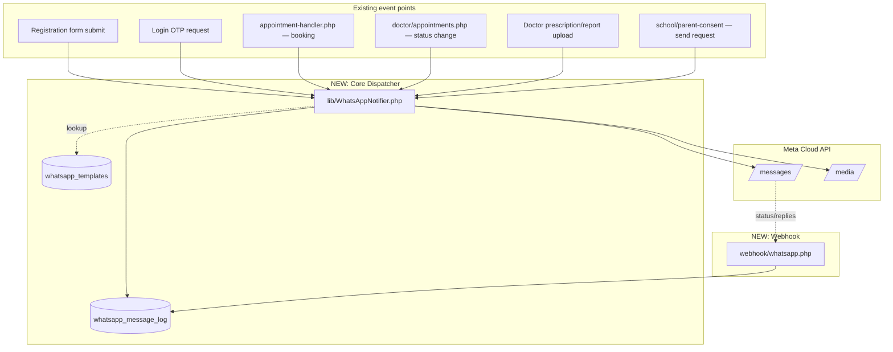

# WhatsApp Automation — Implementation Brief for Claude Code
### Project: rejuvenatedigitalhealth.com — PHP / MySQL / Meta WhatsApp Cloud API (direct)

> Give this file to Claude in VS Code as-is. It contains full context, architecture,
> DB schema, code, and a task checklist — no prior conversation needed.

---

## 0. Project Context

- Stack: PHP + MySQL (mysqli), no framework. Roles: `users` (patients), `doctors`,
  `school_users` (school admins), `school_members` (students/teachers/staff).
- **WhatsApp infra already exists and works** — do not rebuild these:
  - `config/whatsapp.php` — reads `.env` (`WHATSAPP_PHONE_NUMBER_ID`, `WHATSAPP_ACCESS_TOKEN`, etc.)
  - `lib/WhatsAppOtp.php` — `wa_send_otp()`, `wa_send_text()`, `wa_send_template()`,
    `wa_normalize_number()`, `wa_send_account_credentials()`
  - `registration_otps` table + `util/otp-service.php` — registration OTP flow (all 5 roles)
  - `ajax/login-send-otp.php` — login OTP (all roles)
  - `util/function.php: send_appointment_email()` — appointment email to admin+patient+doctor
  - `doctor/appointments.php` — doctor approve/reject appointment status
  - `school_member_documents`, `school_member_prescriptions` — doctor-authored records for school members
  - Provider: **Meta Cloud API direct** (no BSP) — lowest cost route

- **What's missing / what this brief builds:** a central logging dispatcher, document/media
  sending, hooks into the existing event points above, an inbound webhook, reminders, and
  parent-consent WhatsApp delivery with a secure link (not raw data).

- **Priority: low cost.** Meta India rates (July 2026): Utility & Authentication ₹0.115/msg,
  Marketing ₹0.8631/msg (don't use marketing category). No Meta setup/monthly fee. Note: as of
  Oct 1 2026 the 24h free-window exemption for utility messages ends — budget every utility/auth
  send at ₹0.115 regardless of window.

---

## 1. Data Flow



**Rule: every WhatsApp send — old or new — goes through `WhatsAppNotifier`.** Nothing calls
`_wa_post()` / Graph API directly except inside `lib/WhatsAppOtp.php` itself.

---

## 2. Database — New Tables (run this migration first)

```sql
CREATE TABLE IF NOT EXISTS `whatsapp_message_log` (
    `id`              BIGINT UNSIGNED NOT NULL AUTO_INCREMENT,
    `direction`       ENUM('outbound','inbound') NOT NULL DEFAULT 'outbound',
    `event_type`      VARCHAR(60)     NOT NULL,
    `entity_type`     VARCHAR(30)     DEFAULT NULL,
    `entity_id`       INT(11)         DEFAULT NULL,
    `mobile`          VARCHAR(15)     NOT NULL,
    `template_name`   VARCHAR(100)    DEFAULT NULL,
    `message_type`    VARCHAR(20)     NOT NULL DEFAULT 'template',
    `payload`         JSON            DEFAULT NULL,
    `wamid`           VARCHAR(100)    DEFAULT NULL,
    `status`          ENUM('queued','sent','delivered','read','failed','replied') NOT NULL DEFAULT 'queued',
    `error`           VARCHAR(255)    DEFAULT NULL,
    `created_at`      DATETIME        NOT NULL DEFAULT CURRENT_TIMESTAMP,
    `updated_at`      DATETIME        NOT NULL DEFAULT CURRENT_TIMESTAMP ON UPDATE CURRENT_TIMESTAMP,
    PRIMARY KEY (`id`),
    INDEX `idx_wamid` (`wamid`),
    INDEX `idx_entity` (`entity_type`, `entity_id`),
    INDEX `idx_mobile` (`mobile`),
    INDEX `idx_event` (`event_type`)
) ENGINE=InnoDB DEFAULT CHARSET=utf8mb4 COLLATE=utf8mb4_unicode_ci;

CREATE TABLE IF NOT EXISTS `whatsapp_templates` (
    `id`            INT(11)         NOT NULL AUTO_INCREMENT,
    `event_type`    VARCHAR(60)     NOT NULL UNIQUE,
    `template_name` VARCHAR(100)    NOT NULL,
    `language`      VARCHAR(10)     NOT NULL DEFAULT 'en',
    `category`      ENUM('AUTHENTICATION','UTILITY','MARKETING') NOT NULL DEFAULT 'UTILITY',
    `param_order`   JSON            NOT NULL,
    `active`        TINYINT(1)      NOT NULL DEFAULT 1,
    `updated_at`    DATETIME        DEFAULT CURRENT_TIMESTAMP ON UPDATE CURRENT_TIMESTAMP,
    PRIMARY KEY (`id`)
) ENGINE=InnoDB DEFAULT CHARSET=utf8mb4 COLLATE=utf8mb4_unicode_ci;

CREATE TABLE IF NOT EXISTS `whatsapp_optouts` (
    `mobile`        VARCHAR(15) NOT NULL PRIMARY KEY,
    `opted_out_at`  DATETIME    NOT NULL DEFAULT CURRENT_TIMESTAMP
) ENGINE=InnoDB DEFAULT CHARSET=utf8mb4 COLLATE=utf8mb4_unicode_ci;

ALTER TABLE `appointments`
  ADD COLUMN IF NOT EXISTS `reminder_24h_sent` TINYINT(1) NOT NULL DEFAULT 0;
```

Seed `whatsapp_templates` with `event_type` rows once each Meta template is approved:
`otp_verification` (AUTHENTICATION, already live), `welcome_patient`, `welcome_doctor`,
`welcome_school`, `welcome_student`, `welcome_teacher`, `appt_booked_patient`,
`appt_booked_doctor`, `appt_booked_admin`, `appt_confirmed_patient`, `appt_rejected_patient`,
`appt_reminder_24h`, `prescription_ready`, `report_ready`, `parent_consent_request`
(all UTILITY category).

---

## 3. Core Class — `lib/WhatsAppNotifier.php` (new file)

```php
<?php
require_once __DIR__ . '/WhatsAppOtp.php';

class WhatsAppNotifier
{
    private mysqli $conn;

    public function __construct(mysqli $conn) { $this->conn = $conn; }

    public function sendEvent(string $eventType, string $mobile, array $params,
                               ?string $entityType = null, ?int $entityId = null): array
    {
        $mobile = wa_normalize_number($mobile);
        if ($this->isOptedOut($mobile)) {
            $this->log('outbound', $eventType, $entityType, $entityId, $mobile, null, 'text', $params, null, 'failed', 'recipient_opted_out');
            return ['ok' => false, 'error' => 'recipient_opted_out'];
        }

        $tpl = $this->resolveTemplate($eventType);
        if (!$tpl) {
            error_log("[WhatsAppNotifier] No template mapped for event '{$eventType}'");
            return ['ok' => false, 'error' => 'template_not_configured'];
        }

        $orderedParams = $this->orderParams($params, $tpl['param_order']);
        $result = wa_send_template($mobile, $tpl['template_name'], $orderedParams, $tpl['language']);

        $this->log('outbound', $eventType, $entityType, $entityId, $mobile,
            $tpl['template_name'], 'template', $orderedParams,
            $result['wamid'] ?? null, !empty($result['ok']) ? 'sent' : 'failed', $result['error'] ?? null);

        return $result;
    }

    public function sendDocument(string $mobile, string $fileUrl, string $filename, string $caption,
                                  string $eventType, ?string $entityType = null, ?int $entityId = null): array
    {
        $mobile = wa_normalize_number($mobile);
        if ($this->isOptedOut($mobile)) return ['ok' => false, 'error' => 'recipient_opted_out'];

        $result = wa_send_document_by_link($mobile, $fileUrl, $filename, $caption);

        $this->log('outbound', $eventType, $entityType, $entityId, $mobile, null, 'document',
            ['file' => $filename, 'caption' => $caption],
            $result['wamid'] ?? null, !empty($result['ok']) ? 'sent' : 'failed', $result['error'] ?? null);

        return $result;
    }

    private function resolveTemplate(string $eventType): ?array
    {
        $stmt = $this->conn->prepare("SELECT template_name, language, param_order FROM whatsapp_templates WHERE event_type=? AND active=1 LIMIT 1");
        $stmt->bind_param('s', $eventType);
        $stmt->execute();
        $row = $stmt->get_result()->fetch_assoc();
        if (!$row) return null;
        return ['template_name' => $row['template_name'], 'language' => $row['language'] ?? 'en',
                'param_order' => json_decode($row['param_order'] ?? '[]', true) ?: []];
    }

    private function orderParams(array $params, array $order): array
    {
        if (array_keys($params) === range(0, count($params) - 1)) return $params;
        $out = [];
        foreach ($order as $key) $out[] = $params[$key] ?? '';
        return $out;
    }

    private function isOptedOut(string $mobile): bool
    {
        $stmt = $this->conn->prepare("SELECT 1 FROM whatsapp_optouts WHERE mobile=? LIMIT 1");
        $stmt->bind_param('s', $mobile);
        $stmt->execute();
        return (bool) $stmt->get_result()->fetch_assoc();
    }

    private function log(string $direction, string $eventType, ?string $entityType, ?int $entityId,
                          string $mobile, ?string $templateName, string $messageType, array $payload,
                          ?string $wamid, string $status, ?string $error): void
    {
        $stmt = $this->conn->prepare("INSERT INTO whatsapp_message_log
            (direction, event_type, entity_type, entity_id, mobile, template_name, message_type, payload, wamid, status, error)
            VALUES (?,?,?,?,?,?,?,?,?,?,?)");
        $payloadJson = json_encode($payload);
        $stmt->bind_param('sssisssssss', $direction, $eventType, $entityType, $entityId, $mobile,
            $templateName, $messageType, $payloadJson, $wamid, $status, $error);
        $stmt->execute();
    }
}
```

### Add to `lib/WhatsAppOtp.php` (append — do not remove existing functions)

```php
function wa_send_document_by_link(string $mobile, string $fileUrl, string $filename, string $caption = ''): array
{
    $to = wa_normalize_number($mobile);
    if (!defined('WHATSAPP_CONFIGURED') || !WHATSAPP_CONFIGURED) {
        error_log("[WhatsApp] (dev/no-config) document to {$to}: {$fileUrl}");
        return ['ok' => true, 'wamid' => null, 'error' => null, 'debug' => true];
    }
    return _wa_post([
        'messaging_product' => 'whatsapp', 'recipient_type' => 'individual', 'to' => $to,
        'type' => 'document',
        'document' => ['link' => $fileUrl, 'filename' => $filename, 'caption' => $caption],
    ], $to);
}

function wa_upload_media(string $filePath, string $mimeType = 'application/pdf'): ?string
{
    $url = 'https://graph.facebook.com/' . WHATSAPP_API_VERSION . '/' . WHATSAPP_PHONE_NUMBER_ID . '/media';
    $cfile = new CURLFile($filePath, $mimeType, basename($filePath));
    $ch = curl_init($url);
    curl_setopt_array($ch, [
        CURLOPT_POST => true, CURLOPT_RETURNTRANSFER => true,
        CURLOPT_HTTPHEADER => ['Authorization: Bearer ' . WHATSAPP_ACCESS_TOKEN],
        CURLOPT_POSTFIELDS => ['messaging_product' => 'whatsapp', 'file' => $cfile],
    ]);
    $body = curl_exec($ch);
    curl_close($ch);
    $json = json_decode($body, true);
    return $json['id'] ?? null;
}

function wa_send_document_by_media_id(string $mobile, string $mediaId, string $filename, string $caption = ''): array
{
    $to = wa_normalize_number($mobile);
    return _wa_post([
        'messaging_product' => 'whatsapp', 'recipient_type' => 'individual', 'to' => $to,
        'type' => 'document',
        'document' => ['id' => $mediaId, 'filename' => $filename, 'caption' => $caption],
    ], $to);
}
```

> Note: free-form documents (including PDFs) only send inside the 24h customer-service window
> (i.e. patient messaged you recently). Cold-initiated prescription/report sends need a
> **document-header template** variant instead — flag to Claude Code if most sends will be cold.

---

## 4. Hook Points (edit these exact locations)

### 4a. `util/function.php` → inside `send_appointment_email()`, after the 3 existing emails

```php
require_once __DIR__ . '/../lib/WhatsAppNotifier.php';
$wa = new WhatsAppNotifier($conn);

$wa->sendEvent('appt_booked_patient', $appt['patient_phone'], [
    'patient_name' => $appt['patient_name'],
    'doctor_name'  => $appt['doctor_name'] ?? ($data['doctor_name'] ?? 'our team'),
    'date' => $dateLabel, 'time' => $timeLabel,
], 'appointment', $appointmentId);

if (!empty($appt['doctor_id']) && !empty($appt['doctor_phone'])) {
    $wa->sendEvent('appt_booked_doctor', $appt['doctor_phone'], [
        'doctor_name' => $appt['doctor_name'], 'patient_name' => $appt['patient_name'],
        'date' => $dateLabel, 'time' => $timeLabel,
    ], 'appointment', $appointmentId);
}

$adminMobile = $contact['whatsapp'] ?? $contact['phone'] ?? '';
if ($adminMobile) {
    $wa->sendEvent('appt_booked_admin', $adminMobile, [
        'patient_name' => $appt['patient_name'], 'doctor_name' => $appt['doctor_name'] ?? '—',
        'date' => $dateLabel, 'time' => $timeLabel,
    ], 'appointment', $appointmentId);
}
```

### 4b. `doctor/appointments.php` → inside `if (isset($_POST['update_status']))`, after successful UPDATE

```php
if ($update_stmt->execute()) {
    $success_message = "Appointment status updated successfully!";
    if (in_array($new_status, ['approved', 'rejected'], true)) {
        require_once __DIR__ . '/../lib/WhatsAppNotifier.php';
        $wa = new WhatsAppNotifier($conn);
        $p = $conn->prepare("SELECT a.*, COALESCE(u.mobile, a.patient_phone) AS mobile,
                                     COALESCE(u.name, a.patient_name) AS pname
                              FROM appointments a LEFT JOIN users u ON u.id = a.user_id
                              WHERE a.id = ?");
        $p->bind_param('i', $appointment_id);
        $p->execute();
        $row = $p->get_result()->fetch_assoc();
        $event = $new_status === 'approved' ? 'appt_confirmed_patient' : 'appt_rejected_patient';
        $wa->sendEvent($event, $row['mobile'], [
            'patient_name' => $row['pname'], 'doctor_name' => $doctor_name,
            'date' => date('d M Y', strtotime($row['appointment_date'])),
            'time' => date('h:i A', strtotime($row['appointment_time'])),
        ], 'appointment', $appointment_id);
    }
    if ($new_status === 'completed') create_settlement_if_needed($conn, $appointment_id);
}
```

### 4c. Doctor prescription/report send — new endpoint, e.g. `doctor/api/send-prescription-whatsapp.php`

```php
require_once __DIR__ . '/../../lib/WhatsAppNotifier.php';
$wa = new WhatsAppNotifier($conn);
$mediaId = wa_upload_media($pdfPath, 'application/pdf'); // $pdfPath = generated PDF local path
if ($mediaId) {
    wa_send_document_by_media_id($patientMobile, $mediaId,
        "Prescription_{$appointmentId}.pdf",
        "Your prescription from Dr. {$doctorName} — Rejuvenate Digital Health");
}
// Admin: log only (entity_type/entity_id already ties it to the visit) — do NOT
// also WhatsApp the PDF to admin's own number unless explicitly required; it
// widens PHI exposure for no operational benefit (panel visibility is enough).
```

### 4d. Parent consent — new `school/send-consent.php` + `lib/ConsentToken.php`

```php
// lib/ConsentToken.php
function consent_generate_token(int $memberId, int $schoolId, int $ttlHours = 72): string
{
    $expires = time() + ($ttlHours * 3600);
    $payload = "{$memberId}.{$schoolId}.{$expires}";
    $sig = hash_hmac('sha256', $payload, $_ENV['CONSENT_SIGNING_KEY']);
    return base64_encode("{$payload}.{$sig}");
}

function consent_verify_token(string $token): ?array
{
    $decoded = base64_decode($token, true);
    if (!$decoded) return null;
    [$memberId, $schoolId, $expires, $sig] = array_pad(explode('.', $decoded), 4, null);
    if (!$memberId || !$schoolId || !$expires || !$sig) return null;
    $expected = hash_hmac('sha256', "{$memberId}.{$schoolId}.{$expires}", $_ENV['CONSENT_SIGNING_KEY']);
    if (!hash_equals($expected, $sig)) return null;
    if ((int)$expires < time()) return null;
    return ['member_id' => (int)$memberId, 'school_id' => (int)$schoolId];
}
```

```php
// school/send-consent.php
require_once __DIR__ . '/../lib/WhatsAppNotifier.php';
require_once __DIR__ . '/../lib/ConsentToken.php';
$wa = new WhatsAppNotifier($conn);

foreach ($studentsToNotify as $member) {
    $token = consent_generate_token($member['id'], $member['school_id']);
    $link  = rtrim(BASE_URL, '/') . "/school/parent-consent.php?token={$token}";
    $wa->sendEvent('parent_consent_request', $member['parent_mobile'], [
        'student_name' => $member['name'], 'school_name' => $schoolName, 'consent_link' => $link,
    ], 'school_member', $member['id']);
}
```

### 4e. Welcome message — in `util/otp-service.php`, right after `otp_consume_token()` succeeds

```php
$wa->sendEvent("welcome_{$role}", $mobile, ['name' => $name], $entityType, $entityId);
// $role: patient|doctor|school_admin|student|teacher — matches the 5 welcome_* templates
```

---

## 5. Inbound Webhook — `webhook/whatsapp.php` (new file)

```php
<?php
require_once __DIR__ . '/../config/connect.php';
require_once __DIR__ . '/../config/whatsapp.php';

if ($_SERVER['REQUEST_METHOD'] === 'GET') {
    $mode = $_GET['hub_mode'] ?? ''; $token = $_GET['hub_verify_token'] ?? ''; $challenge = $_GET['hub_challenge'] ?? '';
    if ($mode === 'subscribe' && hash_equals($_ENV['WHATSAPP_WEBHOOK_VERIFY_TOKEN'], $token)) { echo $challenge; exit; }
    http_response_code(403); exit;
}

$rawBody = file_get_contents('php://input');
$sigHeader = $_SERVER['HTTP_X_HUB_SIGNATURE_256'] ?? '';
$expected = 'sha256=' . hash_hmac('sha256', $rawBody, $_ENV['WHATSAPP_APP_SECRET']);
if (!hash_equals($expected, $sigHeader)) { http_response_code(401); exit; }

$data = json_decode($rawBody, true);
http_response_code(200); echo 'OK';
if (function_exists('fastcgi_finish_request')) fastcgi_finish_request();

foreach ($data['entry'] ?? [] as $entry) {
    foreach ($entry['changes'] ?? [] as $change) {
        $value = $change['value'] ?? [];
        foreach ($value['statuses'] ?? [] as $status) {
            $wamid = $status['id'] ?? null; $state = $status['status'] ?? null;
            if ($wamid && $state) {
                $stmt = $conn->prepare("UPDATE whatsapp_message_log SET status=? WHERE wamid=?");
                $stmt->bind_param('ss', $state, $wamid); $stmt->execute();
            }
        }
        foreach ($value['messages'] ?? [] as $msg) {
            $from = $msg['from'] ?? ''; $type = $msg['type'] ?? '';
            $text = strtoupper(trim($msg['text']['body'] ?? ''));
            if (in_array($text, ['STOP', 'UNSUBSCRIBE'], true)) {
                $stmt = $conn->prepare("INSERT IGNORE INTO whatsapp_optouts (mobile) VALUES (?)");
                $stmt->bind_param('s', $from); $stmt->execute();
            }
            $stmt = $conn->prepare("INSERT INTO whatsapp_message_log
                (direction, event_type, mobile, message_type, payload, status)
                VALUES ('inbound', 'reply', ?, ?, ?, 'delivered')");
            $payload = json_encode($msg);
            $stmt->bind_param('sss', $from, $type, $payload); $stmt->execute();
        }
    }
}
```

`.env` additions needed:
```
WHATSAPP_WEBHOOK_VERIFY_TOKEN=<random string, also entered in Meta dashboard>
WHATSAPP_APP_SECRET=<Meta App Dashboard -> Settings -> Basic -> App Secret>
CONSENT_SIGNING_KEY=<random 32+ char secret>
```

---

## 6. Reminder Cron — `cron/appointment-reminders.php` (new file, runs every 15 min)

```php
<?php
// crontab: */15 * * * * php /path/to/cron/appointment-reminders.php
require_once __DIR__ . '/../config/connect.php';
require_once __DIR__ . '/../lib/WhatsAppNotifier.php';
$wa = new WhatsAppNotifier($conn);

$stmt = $conn->prepare("
    SELECT a.id, COALESCE(u.mobile, a.patient_phone) AS mobile,
           COALESCE(u.name, a.patient_name) AS pname, d.name AS doctor_name,
           a.appointment_date, a.appointment_time
    FROM appointments a
    LEFT JOIN users u ON u.id = a.user_id
    LEFT JOIN doctors d ON d.id = a.doctor_id
    WHERE a.status = 'approved' AND a.reminder_24h_sent = 0
      AND TIMESTAMP(a.appointment_date, a.appointment_time)
          BETWEEN NOW() + INTERVAL 23 HOUR + INTERVAL 45 MINUTE AND NOW() + INTERVAL 24 HOUR
");
$stmt->execute();
foreach ($stmt->get_result()->fetch_all(MYSQLI_ASSOC) as $r) {
    $wa->sendEvent('appt_reminder_24h', $r['mobile'], [
        'patient_name' => $r['pname'], 'doctor_name' => $r['doctor_name'] ?? 'your doctor',
        'date' => date('d M Y', strtotime($r['appointment_date'])),
        'time' => date('h:i A', strtotime($r['appointment_time'])),
    ], 'appointment', $r['id']);
    $upd = $conn->prepare("UPDATE appointments SET reminder_24h_sent = 1 WHERE id = ?");
    $upd->bind_param('i', $r['id']); $upd->execute();
}
```

---

## 7. Compliance Rules (do not skip)

1. Never put diagnosis/medicine names/test results as plain template text — always send
   prescriptions/reports as **documents** (media) or a signed link to your own site.
2. Webhook signature check (`X-Hub-Signature-256`) is mandatory — already in §5, keep it.
3. Consent links must be signed + expiring (`ConsentToken.php`, §4d) — never a raw sequential
   `student_id` in the URL (IDOR risk into a minor's data).
4. Honor `STOP`/`UNSUBSCRIBE` via `whatsapp_optouts` — `WhatsAppNotifier` already checks this
   before every send; don't bypass it.
5. Restrict `whatsapp_message_log` table read access to admin roles only (it contains
   names/appointment details).

---

## 8. Task Checklist (execute in this order)

- [ ] Phase 1: Run §2 SQL migration. Seed `whatsapp_templates` rows for `otp_verification` only for now (others pending Meta approval).
- [ ] Phase 1: Create `lib/WhatsAppNotifier.php` (§3). Add the 3 new functions to `lib/WhatsAppOtp.php` (§3).
- [ ] Phase 1: Submit remaining templates in Meta WhatsApp Manager (welcome ×5, appt_* ×5, prescription_ready, report_ready, parent_consent_request). Insert their `whatsapp_templates` rows once approved.
- [ ] Phase 2: Add welcome-message call in `util/otp-service.php` (§4e) for all 5 roles.
- [ ] Phase 4: Add booking notifications to `send_appointment_email()` (§4a).
- [ ] Phase 4: Add confirm/reject notification to `doctor/appointments.php` (§4b).
- [ ] Phase 5: Build `doctor/api/send-prescription-whatsapp.php` (§4c), wire a "Send via WhatsApp" button into the existing doctor prescription/report UI.
- [ ] Phase 6: Build `lib/ConsentToken.php` + `school/send-consent.php` (§4d), wire into `school/parent-consent.php` for the verify step.
- [ ] Phase 7: Create `webhook/whatsapp.php` (§5), register URL + verify token in Meta App Dashboard.
- [ ] Phase 8: Create `cron/appointment-reminders.php` (§6), add to crontab.
- [ ] Phase 9: Simple admin screen reading `whatsapp_message_log` (status per appointment, resend button) — build last, once everything above is logging correctly.

**Test each checked item against a Meta test number before moving to the next — see §7's
compliance rules and confirm a `whatsapp_message_log` row lands with `status='sent'` for each
event type before wiring the next hook.**